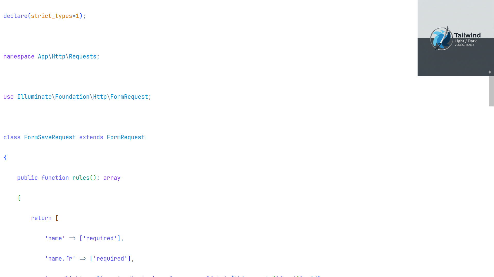
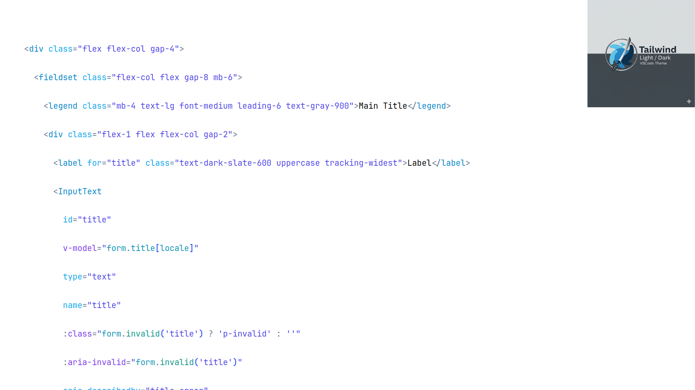
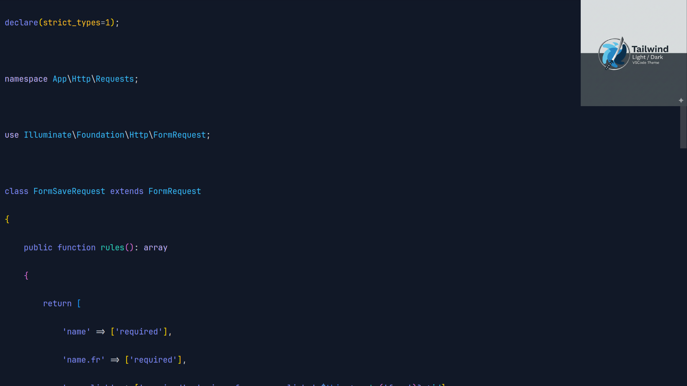
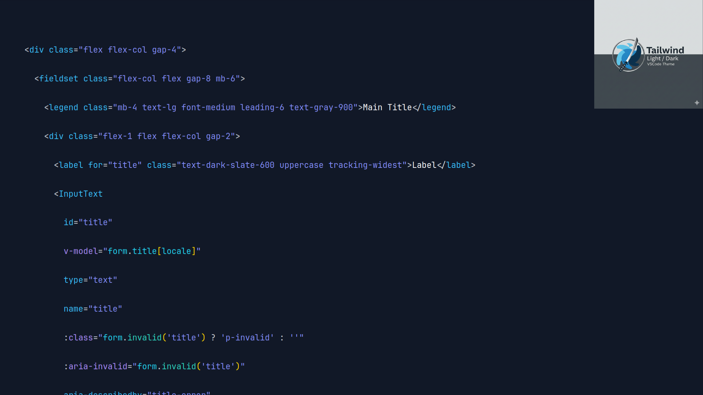

# Tailwind Ninja Themes

Beautiful light and dark color themes for Visual Studio Code, inspired by Tailwind CSS color palette.

## Features

- **Tailwind Light** - A clean, modern light theme with Tailwind CSS colors
- **Tailwind Dark** - A comfortable dark theme with Tailwind CSS colors

Both themes provide excellent contrast and readability for long coding sessions.

## Installation

1. Open VS Code
2. Go to Extensions (Ctrl+Shift+X / Cmd+Shift+X)
3. Search for "Tailwind Ninja Themes"
4. Click Install

## Usage

1. Open Command Palette (Ctrl+Shift+P / Cmd+Shift+P)
2. Type "Preferences: Color Theme"
3. Select either "Tailwind Light" or "Tailwind Dark"

## Screenshots

### Tailwind Light Theme

### Tailwind Dark Theme

## Contributing

Contributions are welcome! Please feel free to submit a Pull Request.

## License

MIT License - see LICENSE file for details

## Author

Created by [LudovicGuenet](https://github.com/LudovicGuenet)
